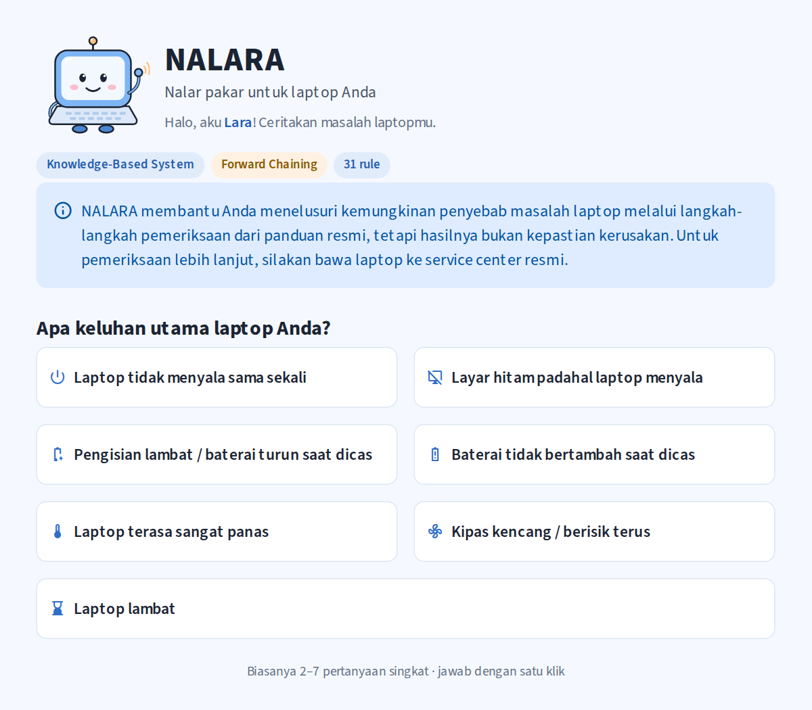
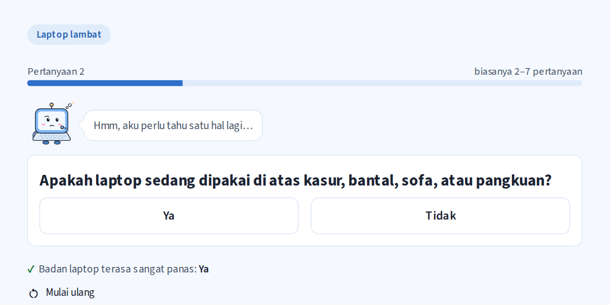
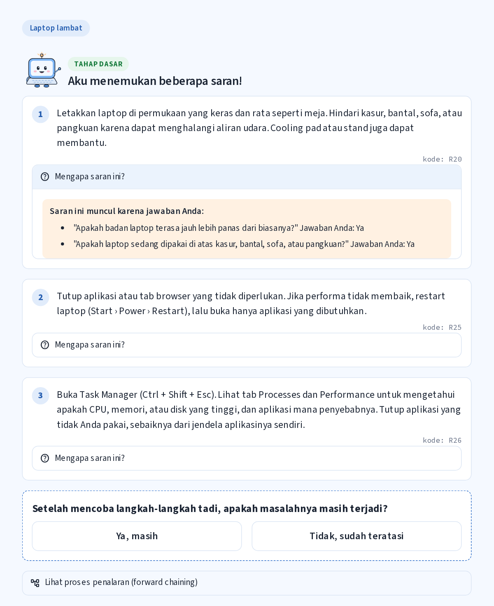
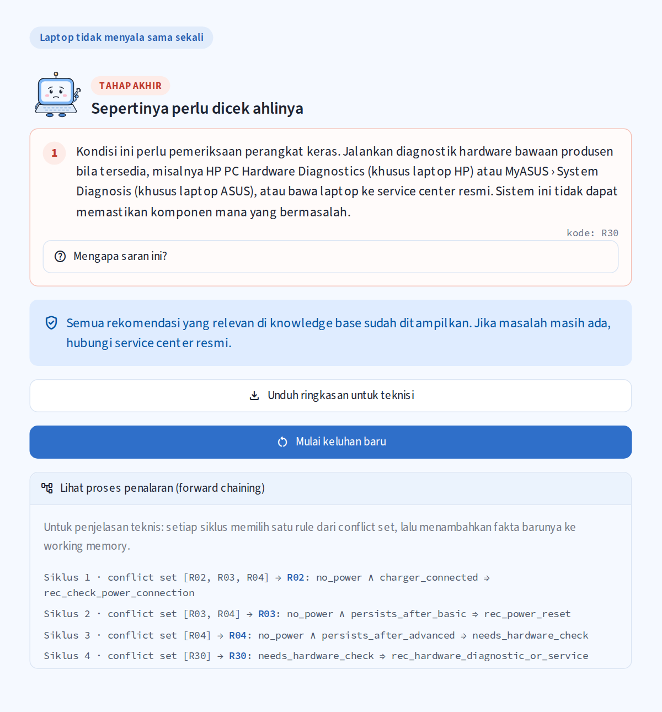
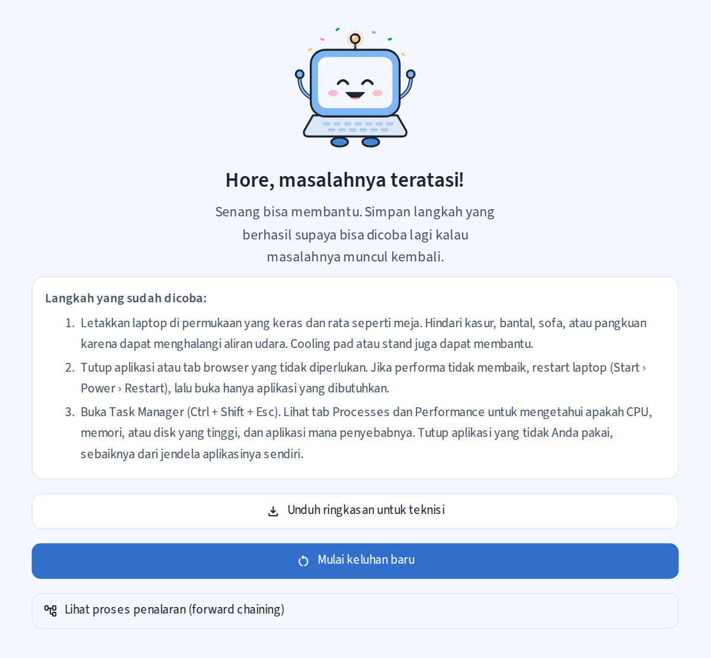
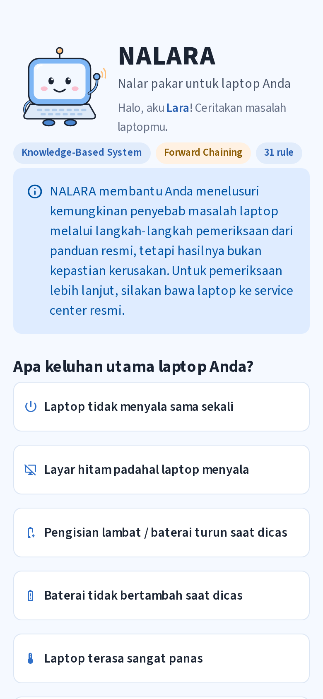
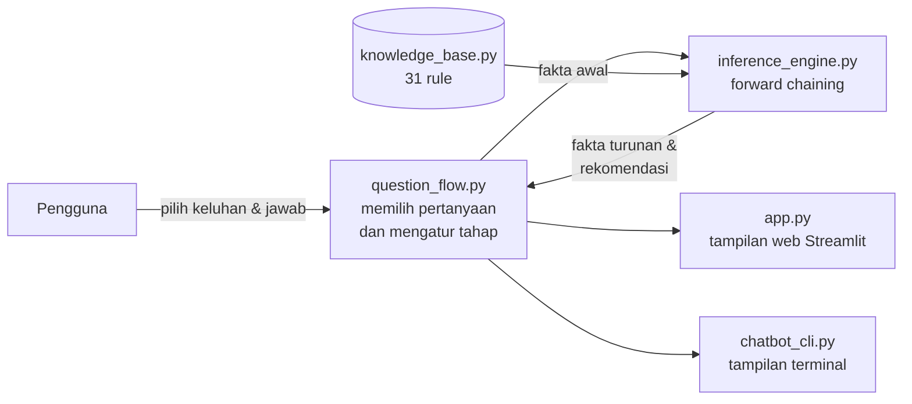

# NALARA — Troubleshooting Laptop Berbasis Knowledge-Based System


**NALARA** adalah asisten troubleshooting yang membantu pengguna menelusuri kemungkinan penyebab masalah umum pada laptop Windows melalui langkah-langkah pemeriksaan dari panduan resmi. Pengguna cukup memilih keluhan dan menjawab beberapa pertanyaan singkat. NALARA lalu memberikan saran bertahap (dasar → lanjutan → akhir) beserta alasan setiap saran.

Sistem ini dibangun sebagai **Knowledge-Based System** dengan **31 rule** yang disusun dari dokumentasi resmi Microsoft, ASUS, HP, dan Lenovo, dan menggunakan inferensi **forward chaining**.

> **Coba langsung (tanpa instalasi):** **[https://GANTI-DENGAN-LINK.streamlit.app](https://GANTI-DENGAN-LINK.streamlit.app)**
> Bisa dibuka dari laptop, tablet, maupun HP.

> **Catatan:** NALARA membantu menelusuri kemungkinan penyebab masalah, tetapi hasilnya bukan kepastian kerusakan. Untuk pemeriksaan lebih lanjut, silakan bawa laptop ke service center resmi.

*Proyek mata kuliah Kecerdasan Artifisial — DTETI, Universitas Gadjah Mada, 2026.*

---

## Daftar isi
- [Tampilan](#tampilan)
- [Keluhan yang ditangani](#keluhan-yang-ditangani)
- [Cara kerja sistem](#cara-kerja-sistem)
- [Cara menjalankan di komputer sendiri](#cara-menjalankan-di-komputer-sendiri)
- [Struktur file](#struktur-file)
- [Sumber pengetahuan](#sumber-pengetahuan)
- [Keterbatasan](#keterbatasan)
- [Tim](#tim)

---

## Tampilan

| Halaman awal | Pertanyaan satu per satu |
|---|---|
|  |  |

| Rekomendasi + "Mengapa saran ini?" | Tahap akhir + proses penalaran |
|---|---|
|  |  |

| Masalah teratasi | Tampilan di HP |
|---|---|
|  |  |

Fitur utama:
- **Satu pertanyaan per layar** dengan tombol besar. Pertanyaan dipilih otomatis dari knowledge base, jadi hanya pertanyaan yang relevan yang ditanyakan (biasanya 2–7 pertanyaan).
- **Saran bertahap**: tahap dasar → lanjutan → akhir. Tahap berikutnya hanya muncul jika pengguna menjawab masalahnya masih terjadi.
- **"Mengapa saran ini?"**: menunjukkan jawaban pengguna yang membuat sebuah saran muncul.
- **"Lihat proses penalaran"**: menampilkan jejak forward chaining (siklus, conflict set, rule yang terpicu).
- **Unduh ringkasan untuk teknisi**: berisi keluhan, jawaban, dan saran yang sudah dicoba.

---

## Keluhan yang ditangani

| Keluhan utama | Contoh saran |
|---|---|
| Laptop tidak menyala sama sekali | Cek sambungan charger, power reset |
| Layar hitam padahal laptop menyala | Reset driver grafis, restart Windows Explorer, Safe Mode, rollback driver |
| Pengisian lambat / baterai turun saat dicas | Cek sambungan, gunakan charger yang sesuai, diagnostik baterai |
| Baterai tidak bertambah saat dicas | Power reset, cek fitur pembatas pengisian, diagnostik baterai |
| Laptop terasa sangat panas | Pindah ke permukaan keras, bebaskan ventilasi, bersihkan debu dengan aman |
| Kipas kencang / berisik terus | Cek Task Manager, periksa suara kipas yang tidak normal |
| Laptop lambat | Tutup aplikasi, kosongkan penyimpanan, update & scan |

Jika langkah mandiri tidak berhasil atau ada tanda kerusakan perangkat keras, NALARA mengarahkan ke diagnostik bawaan produsen atau service center resmi.

---

## Cara kerja sistem



**Knowledge base** (`knowledge_base.py`) disimpan sebagai data, terpisah dari mesin inferensi:

| Komponen | Jumlah | Contoh |
|---|---|---|
| Fakta awal (gejala, kondisi, tahap) | 22 | `laptop_hot`, `soft_surface`, `persists_after_basic` |
| Fakta turunan | 3 | `charging_issue`, `cooling_check_needed`, `needs_hardware_check` |
| Rekomendasi | 22 | `rec_move_to_hard_surface`, `rec_power_reset` |
| Rule IF–THEN | 31 | R20: `cooling_check_needed ∧ soft_surface → rec_move_to_hard_surface` |

Daftar lengkap rule beserta sumbernya ada di [`verifikasi_knowledge_base.md`](verifikasi_knowledge_base.md).

**Forward chaining** (`inference_engine.py`) berjalan dalam siklus:
1. **Match**: cari semua rule yang seluruh kondisinya ada di working memory. Hasilnya disebut *conflict set*.
2. **Select**: pilih satu rule dengan *conflict resolution*: tahap paling awal, rule fakta turunan lebih dulu, lalu *salience*, lalu urutan rule.
3. **Fire**: tambahkan kesimpulan rule ke working memory. Setiap rule hanya terpicu sekali (*refraction*).
4. Ulangi sampai conflict set kosong.

Setiap kali pengguna menjawab, fakta baru ditambahkan dan forward chaining dijalankan ulang. Pertanyaan berikutnya dipilih dari rule yang sebagian kondisinya sudah terpenuhi, sehingga sistem tidak memakai daftar pertanyaan tetap per keluhan.

---

## Cara menjalankan di komputer sendiri

Kebutuhan: **Python 3.10 atau lebih baru**.

```bash
# 1. Pasang library
pip install -r requirements.txt

# 2. Jalankan aplikasi web
python -m streamlit run app.py
```

Browser akan terbuka di `http://localhost:8501`. Untuk membuka dari HP, sambungkan HP ke Wi-Fi yang sama, lalu buka alamat *Network URL* yang muncul di terminal.

Saat pertama kali dijalankan, Streamlit mungkin meminta email. Biarkan kosong, lalu tekan Enter.

**Versi terminal (chatbot teks):**
```bash
python chatbot_cli.py
```

**Tes otomatis** (81 tes; 1 tes panjang dilewati secara bawaan):
```bash
python -m unittest -v
```
Tes panjang itu mencoba ke-460 kemungkinan urutan jawaban di aplikasi web dan memastikan hasilnya sama dengan logika inti (±7 menit):
```bash
# Windows PowerShell
$env:NALARA_SEMUA_JALUR="1"; python -m unittest test_app -v
# macOS / Linux
NALARA_SEMUA_JALUR=1 python -m unittest test_app -v
```

---

## Struktur file

| File | Isi |
|---|---|
| `knowledge_base.py` | Fakta, rekomendasi, 31 rule, dan daftar sumber |
| `inference_engine.py` | Mesin forward chaining (match → conflict set → select → fire) |
| `question_flow.py` | Logika percakapan: memilih pertanyaan dan mengatur tahap |
| `app.py` | Tampilan web (Streamlit) |
| `chatbot_cli.py` | Tampilan terminal |
| `test_inference_engine.py`, `test_question_flow.py`, `test_app.py` | Tes otomatis |
| `verifikasi_knowledge_base.md` | Tabel fakta, rule, dan sumber (dibuat otomatis dari kode) |
| `checklist_tahap1.md` | Checklist pencocokan rule dengan dokumen audit |
| `assets/` | Gambar maskot Lara (SVG + PNG) |
| `screenshots/` | Tangkapan layar aplikasi |
| `.streamlit/config.toml` | Tema warna aplikasi |
| `requirements.txt` | Library yang dibutuhkan |

---

## Sumber pengetahuan

Rule disusun dari dokumentasi troubleshooting resmi berikut. Kode sumber (S1–S14, T1–T3) dicantumkan pada setiap rule di `knowledge_base.py`.

| Kode | Produsen | Dokumen |
|---|---|---|
| S1 | Microsoft | [PC is charging slowly or discharging while it’s plugged in](https://support.microsoft.com/en-us/windows/experience/power-battery/pc-is-charging-slowly-or-discharging-while-it-s-plugged-in) |
| S2 | Microsoft | [Troubleshooting blank screens in Windows](https://support.microsoft.com/en-us/windows/hardware/display-graphics/troubleshooting-blank-screens-in-windows) |
| S3 | Microsoft | [Tips to improve PC performance in Windows](https://support.microsoft.com/en-us/windows/experience/performance-optimization/tips-to-improve-pc-performance-in-windows) |
| S4 | ASUS | [[Windows 11/10] Troubleshooting - Overheating and Fan issues (FAQ 1015064)](https://www.asus.com/support/faq/1015064/) |
| S5 | ASUS | [Troubleshooting - Slow Charging / Battery Draining while Plugged in (FAQ 1043611)](https://www.asus.com/support/faq/1043611/) |
| S6 | ASUS | [Battery and Power Adapter (Charger) Specifications and Recommended Usage (FAQ 1015066)](https://www.asus.com/support/faq/1015066/) |
| S7 | HP | [HP Battery Check: Fix laptop battery not charging](https://support.hp.com/us-en/help/computer/battery-adapter-issues) |
| S8 | HP | [How to Fix HP Computer and Laptop Power On and Boot Up Problems](https://support.hp.com/bg-en/help/computer/power-boot-issues) |
| S9 | HP | [HP Notebook PCs - Fan is noisy and spins constantly (Windows)](https://support.hp.com/us-en/document/ish_3045299-2819686-16) |
| S10 | HP | [Reduce heat inside the laptop to prevent overheating in Windows](https://support.hp.com/si-en/document/ish_3894569-1692683-16) |
| S11 | Lenovo | [Troubleshooting battery issues - PC (HT080185)](https://support.lenovo.com/sg/en/solutions/ht080185-troubleshooting-battery-issues-thinkpad) |
| S12 | Lenovo | [Fan runs at a higher than expected speed - Windows (HT077046)](https://pcsupport.lenovo.com/us/en/solutions/ht077046) |
| S13 | Lenovo | [Freezing or slow performance issues - Windows 10, 11 (HT510168)](https://pcsupport.lenovo.com/us/en/solutions/ht510168) |
| S14 | Lenovo | [No power or system does not run on battery power - ThinkPad (HT080218)](https://pcsupport.lenovo.com/us/en/solutions/ht080218) |
| T1 | ASUS | [Troubleshooting - Device Boot Failure or No Display After Boot (Black Screen) (FAQ 1014276)](https://www.asus.com/support/faq/1014276/) (tambahan) |
| T2 | ASUS | [Troubleshooting - Battery not supplying power/charging… (FAQ 1012793)](https://www.asus.com/support/faq/1012793/) (tambahan) |
| T3 | HP | [HP PCs - How to power reset your computer](https://support.hp.com/us-en/document/ish_1997208-1551050-16) (tambahan) |

---

## Keterbatasan

- NALARA **memberi saran pemeriksaan, bukan diagnosis pasti**. Sistem tidak dapat memastikan komponen mana yang rusak.
- Hanya mencakup **laptop Windows** dan **tujuh keluhan umum** di atas.
- Pengetahuan terbatas pada 31 rule dari dokumentasi resmi yang tercantum. Kondisi di luar rule tersebut tidak dikenali.
- Untuk keluhan **laptop panas** yang tidak dipakai di permukaan lunak dan ventilasinya tidak tertutup, belum ada saran tahap dasar yang cocok. Aplikasi menampilkan catatan untuk kasus ini, lalu menanyakan apakah masalah masih terjadi untuk lanjut ke tahap berikutnya.
- Sistem bergantung pada jawaban pengguna. Jawaban yang keliru dapat menghasilkan saran yang kurang tepat.
- Sebagian langkah (misalnya diagnostik bawaan) hanya tersedia untuk merek tertentu. Hal ini disebutkan di dalam teks sarannya.

---

## Tim

| Nama | NIM | Peran |
|---|---|---|
| _(isi)_ | _(isi)_ | _(isi)_ |
| _(isi)_ | _(isi)_ | _(isi)_ |
| _(isi)_ | _(isi)_ | _(isi)_ |

Maskot **Lara** adalah karakter orisinal yang dibuat untuk proyek ini.
